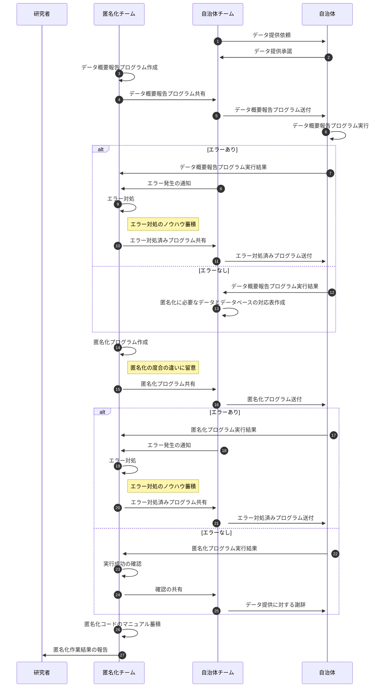

# 自治体データ匿名化

## 概要

- 自治体データの匿名化を行う

## 自治体との関係

```mermaid
sequenceDiagram
    autonumber
    participant 研究者
    participant 匿名化チーム
    participant 自治体チーム
    participant 自治体


    自治体チーム ->> +自治体 : データ提供依頼
    自治体     ->> +自治体チーム : データ提供承諾
    匿名化チーム ->> 匿名化チーム : データ概要報告プログラム作成
    匿名化チーム ->> +自治体チーム : データ概要報告プログラム共有
    自治体チーム ->> +自治体 : データ概要報告プログラム送付
    自治体 ->> 自治体 : データ概要報告プログラム実行
    alt エラーあり
        自治体 ->> 匿名化チーム : データ概要報告プログラム実行結果
        自治体チーム ->> +匿名化チーム : エラー発生の通知
        匿名化チーム ->> 匿名化チーム : エラー対処
        Note right of 匿名化チーム : エラー対処のノウハウ蓄積
        匿名化チーム ->> +自治体チーム : エラー対処済みプログラム共有
        自治体チーム ->> +自治体 : エラー対処済みプログラム送付
    else エラーなし
        自治体 ->> 自治体チーム : データ概要報告プログラム実行結果
        自治体チーム ->> 自治体チーム : 匿名化に必要なデータとデータベースの対応表作成
    end
    匿名化チーム ->> 匿名化チーム : 匿名化プログラム作成
    Note right of 匿名化チーム : 匿名化の度合の違いに留意
    匿名化チーム ->> +自治体チーム : 匿名化プログラム共有
    自治体チーム ->> +自治体 : 匿名化プログラム送付
    alt エラーあり
        自治体 ->> 匿名化チーム : 匿名化プログラム実行結果
        自治体チーム ->> +匿名化チーム : エラー発生の通知
        匿名化チーム ->> 匿名化チーム : エラー対処
        Note right of 匿名化チーム : エラー対処のノウハウ蓄積
        匿名化チーム ->> +自治体チーム : エラー対処済みプログラム共有
        自治体チーム ->> +自治体 : エラー対処済みプログラム送付
    else エラーなし
        自治体 ->> 匿名化チーム : 匿名化プログラム実行結果
        匿名化チーム ->> 匿名化チーム : 実行成功の確認
        匿名化チーム ->> 自治体チーム : 確認の共有
        自治体チーム ->> 自治体 : データ提供に対する謝辞
    end
    匿名化チーム ->> 匿名化チーム : 匿名化コードのマニュアル蓄積
    匿名化チーム ->> 研究者　:　匿名化作業結果の報告


```
